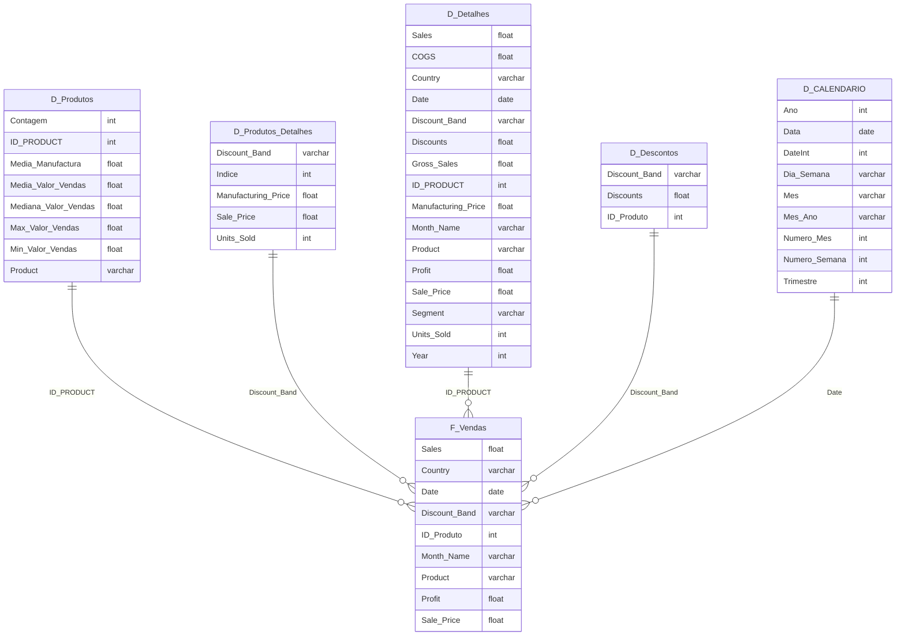

# 🌟 Sales Star Schema

Este projeto utiliza um **Esquema Estrela** (*Star Schema*) para organizar e modelar os dados de vendas no **Power BI**. A seguir está a explicação das tabelas de dimensões e da tabela fato, bem como a relação entre elas.

## 🛠️ Diagrama em Mermaid

Abaixo está uma representação visual do esquema estrela utilizando o formato **Mermaid**:

## 🗂️ Descrição das Tabelas

### 1. **F_Vendas** (Fato) 📊
A tabela fato centraliza os dados de vendas e contém as seguintes colunas:

- `Sales`: Valor total da venda 💵.
- `Country`: País onde a venda foi realizada 🌍.
- `Date`: Data da venda 📅.
- `Discount Band`: Faixa de desconto aplicada 💸.
- `ID_Produto`: Identificador do produto 🆔.
- `Month Name`: Nome do mês da venda 📆.
- `Product`: Nome do produto 🏷️.
- `Profit`: Lucro gerado pela venda 💰.
- `Sale Price`: Preço de venda 🏷️.

### 2. **D_Produtos** (Dimensão) 📦
Esta tabela contém informações detalhadas sobre os produtos:

- `ID_PRODUCT`: Identificador único do produto 🆔.
- `Contagem`: Contagem de produtos vendidos 🔢.
- `Média da manufatura`: Custo médio de fabricação 🛠️.
- `Média do valor de vendas`: Valor médio de venda 💵.
- `Mediana do valor de vendas`: Mediana do valor de venda 💰.
- `Valor máximo de venda`: Valor máximo de venda 💸.
- `Valor mínimo de venda`: Valor mínimo de venda 🔻.
- `Product`: Nome do produto 🏷️.

### 3. **D_Produtos_Detalhes** (Dimensão) 🔍
Esta tabela contém detalhes adicionais dos produtos:

- `Discount Band`: Faixa de desconto aplicada ao produto 💸.
- `Indice`: Índice do produto 📊.
- `Manufacturing Price`: Custo de fabricação 🏭.
- `Sale Price`: Preço de venda 🏷️.
- `Units Sold`: Unidades vendidas 📦.

### 4. **D_Detalhes** (Dimensão) 📝
Esta tabela traz detalhes adicionais sobre vendas e produtos, incluindo:

- `Sales`: Valor da venda 💵.
- `COGS`: Custo dos bens vendidos (*Cost of Goods Sold*) 🏭.
- `Country`: País da venda 🌍.
- `Date`: Data da venda 📅.
- `Discount Band`: Faixa de desconto aplicada 💸.
- `Discounts`: Valor de desconto 🔖.
- `Gross Sales`: Receita bruta 💰.
- `ID_PRODUCT`: Identificador do produto 🆔.
- `Manufacturing Price`: Custo de fabricação 🛠️.
- `Month Name`: Nome do mês da venda 📆.
- `Product`: Nome do produto 🏷️.
- `Profit`: Lucro gerado 💰.
- `Sale Price`: Preço de venda 🏷️.
- `Segment`: Segmento de mercado 🛍️.
- `Units Sold`: Unidades vendidas 📦.
- `Year`: Ano da venda 📅.

### 5. **D_Descontos** (Dimensão) 💸
Esta tabela contém dados relacionados a descontos aplicados:

- `Discount Band`: Faixa de desconto 💸.
- `Discounts`: Valor de desconto 🔖.
- `ID_Produto`: Identificador do produto 🆔.

### 6. **D_CALENDARIO** (Dimensão) 📅
Tabela de calendário com informações sobre datas:

- `Ano`: Ano 📅.
- `Data`: Data completa 📅.
- `DateInt`: Data no formato numérico 🔢.
- `Dia da Semana`: Nome do dia da semana 📆.
- `Mês`: Nome do mês 🗓️.
- `Mês Ano`: Combinação de mês e ano 🗓️.
- `Número Mês`: Número do mês 🔢.
- `Número Semana`: Número da semana 📆.
- `Trimestre`: Trimestre do ano 🔄.

## 🔗 Relacionamento entre as Tabelas

As tabelas de dimensões estão ligadas à tabela fato **F_Vendas**, utilizando as chaves:

- **D_Produtos** se relaciona com **F_Vendas** pela coluna `ID_PRODUCT` 🔗.
- **D_Produtos_Detalhes** se relaciona com **F_Vendas** pela coluna `Discount Band` 🔗.
- **D_Detalhes** se relaciona com **F_Vendas** pela coluna `ID_PRODUCT` 🔗.
- **D_Descontos** se relaciona com **F_Vendas** pela coluna `Discount Band` 🔗.
- **D_CALENDARIO** se relaciona com **F_Vendas** pela coluna `Date` 🔗.

### Estrutura em Esquema Estrela ⭐

Esse modelo segue o padrão de **Esquema Estrela**, onde a tabela fato (**F_Vendas**) está no centro do modelo e se conecta a diversas tabelas de dimensões, permitindo análises detalhadas e agregadas de vendas. Cada dimensão agrega um conjunto específico de dados que facilita as consultas e relatórios no Power BI.

---

> Este README fornece uma visão completa da estrutura e organização do banco de dados utilizando um **Esquema Estrela** ⭐, facilitando a análise de dados e criação de relatórios detalhados no **Power BI** 📊.
